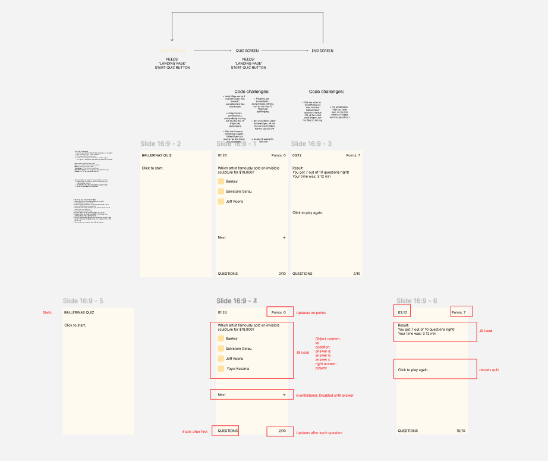
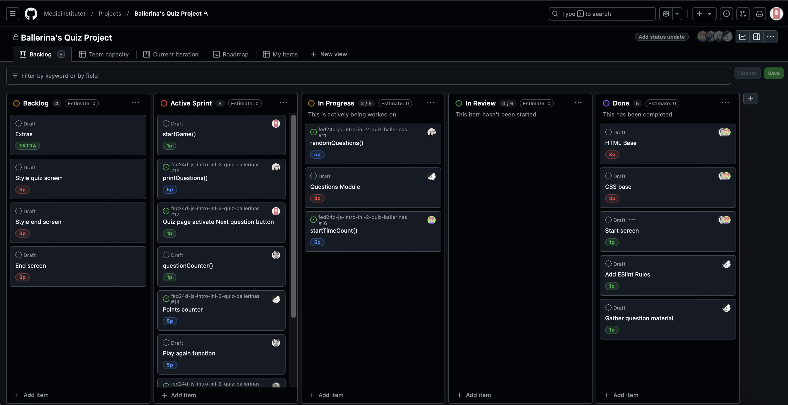
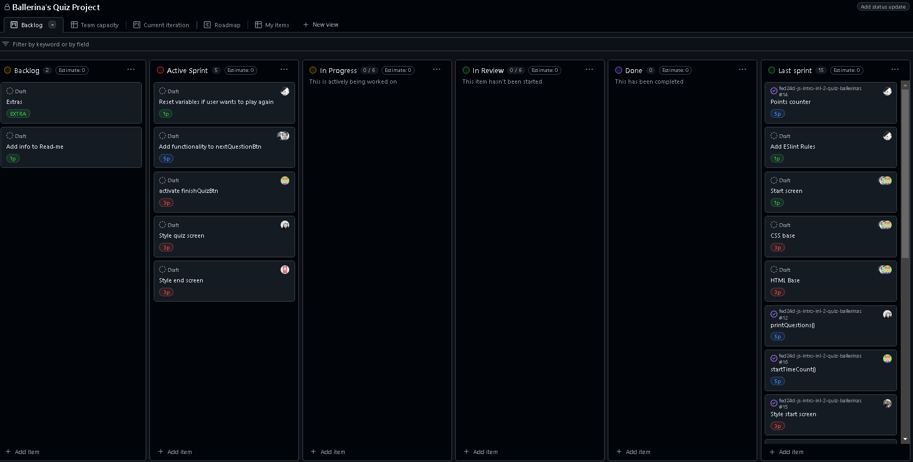
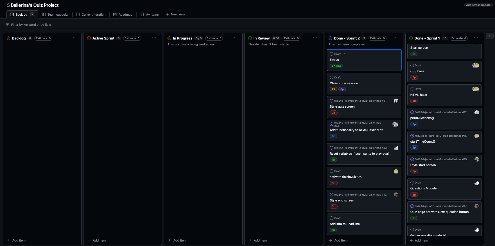

# Ballerina Quiz

A group project during our education at Medieinstitutet where we created a quiz about "Ballerinas", a type of Swedish cookies. 🍪

## 🔗 Links
[Live Project](https://medieinstitutet.github.io/fed24d-js-intro-inl-2-quiz-ballerinas/)

[Repo](https://github.com/Medieinstitutet/fed24d-js-intro-inl-2-quiz-ballerinas/)

[Pseudo code](pseudokod.md)

## ✨ Features
- Presents a **startingpage** to the user
- Presents a **quiz page**, showing one question at a time with three answer choices. 
- A **timer** starts when the quiz begins, tracking total game time, to present at the end. 
- The **current question** number is presented at the botton of the page. 
- After 10 questions an **end page** appears, showing the number of correct answers and total playtime. 

## ▶️ Usage
- Start the game by pressing "Start game".
- Select one out of three options that you think is the correct answer, then press next question.
- When 10 questions have been answered, press finish quiz which is presented instead of next question.
- Play again by pressing the play again button on the end page

## 👩🏻‍💻 Tech Stack

    

 

 

## 👏 Credits
Built by Davkje, AgnesWilson, CatrinTQ, KarinHson, Osklundev & Carl4000 with help from postmodernistx, jenmwa & MariaLBovin.

### 🎨 Wireframe

## 🎯 Agile method

### 📝 Group comitments 
- [Contract](comitments.md)

### 🙋‍♀️ Standups 
We have had daily standups that you can follow here:

- [Week 51](dailies/v.51.md)

- [Week 1](dailies/v1.md)

- [Week 2](dailies/v2.md)

### 🔥 Retros
We have had two sprints and retros:

- [Retro 1](assets/screenshots/retro-one.png)
- [Retro 2](assets/screenshots/retro-two.png)

### 📸 Screen grab

Base planning of the project in sprint one, two and also after the last sprint. 

## 🚀 Performance

- [lighthouse](assets/screenshots/lighthouse.png)
- [html-validation](assets/screenshots/html-validation.png)
